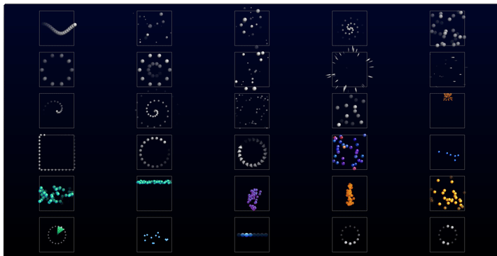
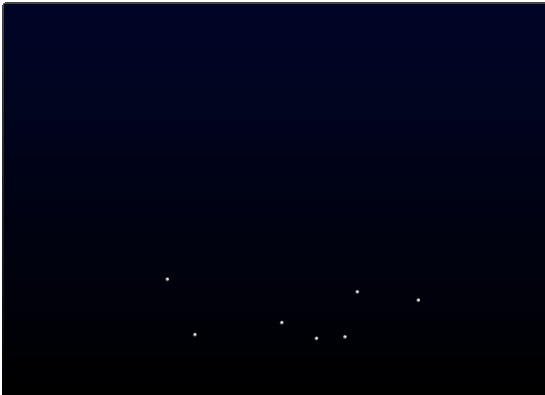

# SpinnerDemo - WPF

## v1.0.0.0 - October, 2025
**Dependencies**

| Assembly | Version |
| ---- | ---- |
| .NET | 8.0 |

- A [WPF](https://learn.microsoft.com/en-us/dotnet/desktop/wpf) application that demostrates my home-brew `Spinner` control.
- Visibility determines if animation runs, so this can be bound to view model properties, e.g. `IsBusy`/`IsNotBusy`.
- If mode is set to `SpinnerRenderMode.RotateCanvas` then some of the more advanced animations will not render correctly, it's recommended to keep the mode set to `SpinnerRenderMode.AnimatePositions` which employs the `CompositionTarget.Rendering` surface event (this also avoids rotating any brush gradients, which can cause a wobble effect).
- Most render methods have their own data elements, however some are shared, e.g. the **Snow/Wind/Space** modes all use the `_rain` arrays.
- Many of these modes/shapes could be used as a screen saver if you desire, e.g. the `Meteor1` and `Meteor2` mode are entertaining to watch in a maximized transparency window.
- If you're looking for a basic/classic spinner, then the `Dots` and `Chase` modes are probably what you want.
- Each mode is accompanied by appropriate configuration settings, e.g. the `Fountain` mode offers the following:
    - `FountainBaseLife`
    - `FountainBaseSpeed`
    - `FountainGravity`
    - `FountainFadeRate`
    - `FountainFromBottom`
    - `FountainSpreadDegrees`
    - `FountainColorTransition`
    - `FountainColorTransitionEaseOut`
    - `FountainTransitionStartColor`
    - `FountainTransitionMidColor`
    - `FountainTransitionEndColor`

## Spinner Control

- The re-usable spiner control has many modes for rendering shapes:

```
public enum SpinnerRenderShape
{
    Dots,       // for standard/classic spinner
    Chase,      // for spinner chase animation
    Worm,       // for wiggle worm animation
    Spiral,     // for spiral rotation animation
    Polys,      // for spinner with more complex shapes
    Snow,       // for raining/snowing animation
    Wind,       // for horizontal animation
    Wave,       // for sine wave animation
    Space,      // for starfield animation
    Line,       // for line warp animation
    Stripe,     // for exaggerated line animation
    Bounce,     // for dot bouncing animation
    Square,     // for walking square animation
    Rings,      // for concentric ring animation
    Pulse,      // for ring pulse animation
    Twinkle1,   // for twinkling star animation
    Twinkle2,   // for twinkling star animation (with enhanced gradient brushes)
    Meteor1,    // for shooting star animation
    Meteor2,    // for shooting star animation (with enhanced color palette)
    Falling,    // for drop animation
    Explode,    // for explosion animation
    Fountain,   // for fountain animation
    Radar,      // for radar arm animation
    Progress,   // for "progress bar" animation
    Splash,     // for raining with splash animation
    Fireworks,  // for launch and explode animation
    Sand,       // for grain pile animation
    Gears,      // for double gear animation
}
```




